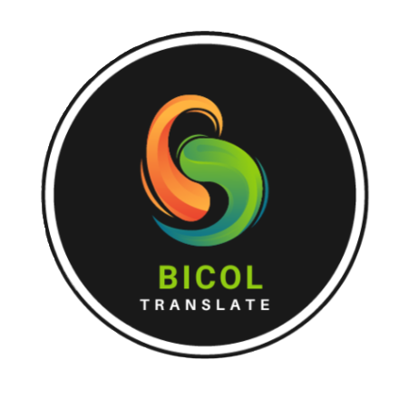

# Bicol_Translate [readme]

The Bikol languages or Bicolano languages are a group of Central Philippine languages spoken mostly in the Bicol Peninsula in the island of Luzon, the neighboring island province of Catanduanes and the island of Burias in Masbate.

Bicol Translate is a Collection of Bikol languages or Bicolano languages with a translation to Tagalog Language or English Language..

